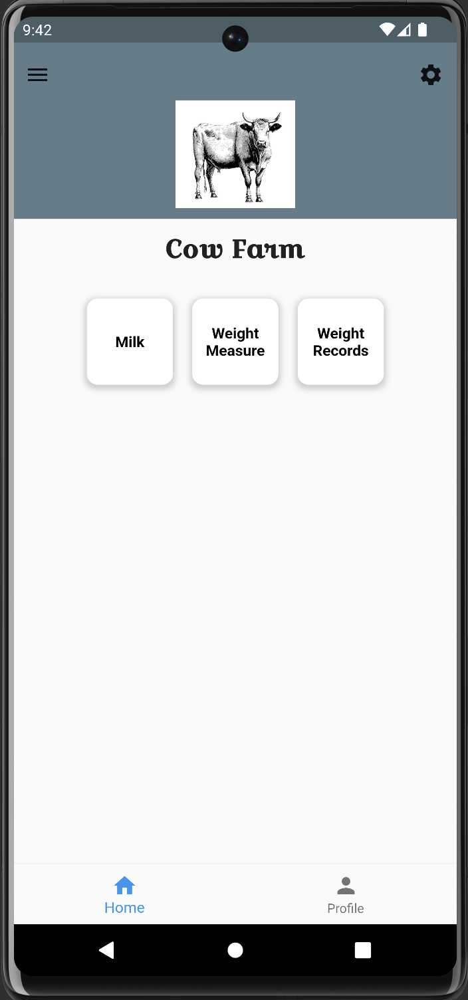
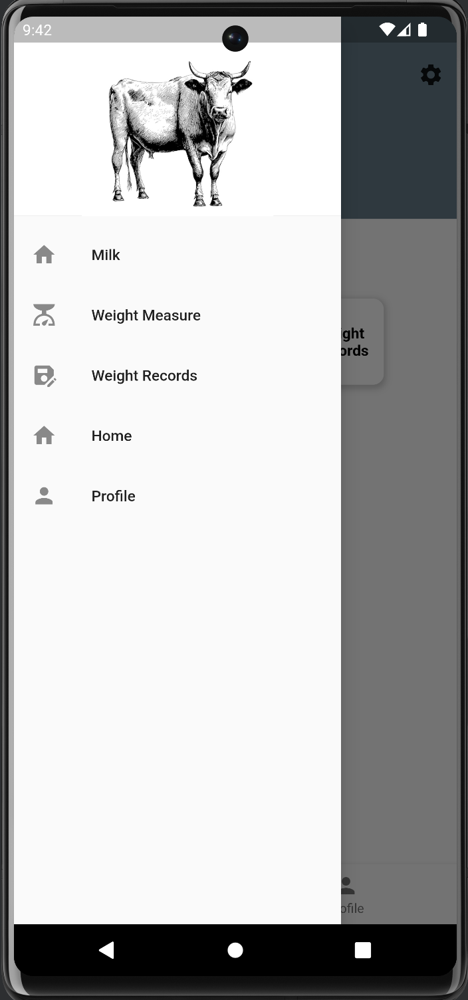

# Demo

# Farm

This is an application using Flutter as front-end.

This app can predicts weight of cattle using only one side image of the cattle approximately 85%. Backend of this project is in django framework and Front end is using 
Flutter.

